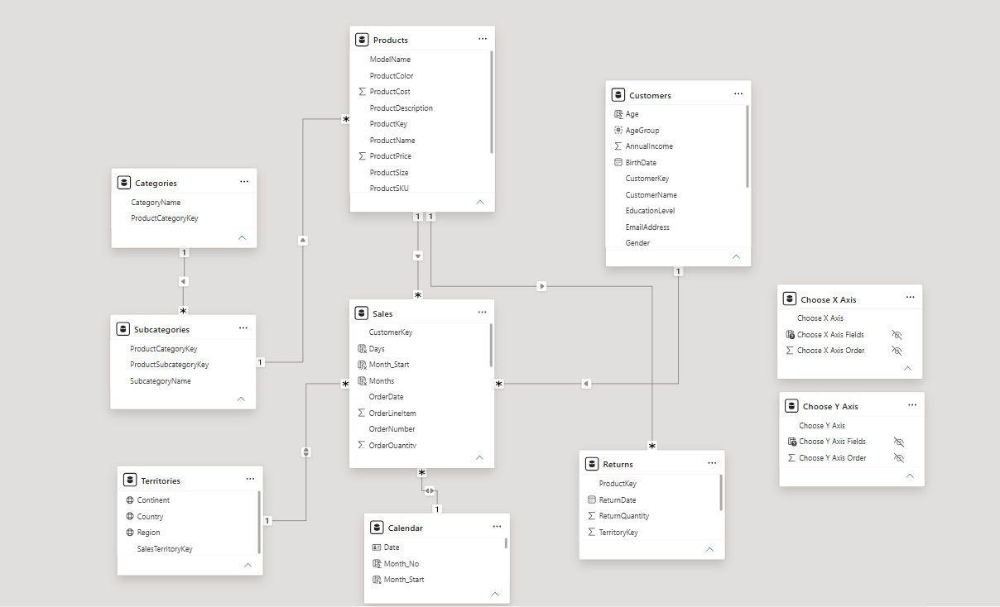

# Data Model

## Overview

This project follows a **Star Schema** data model to ensure efficient querying, simplified relationships, and optimized report performance.

The model consists of a central **Sales** fact table surrounded by multiple dimension tables that provide descriptive attributes for analysis.

---

# Data Model Diagram

---

# Schema Design

### Fact Tables

| Table | Description |
|--------|-------------|
| **Sales** | Stores sales transactions including order quantity, customer, product, territory, and order date. |
| **Returns** | Stores returned products and return quantities. |

---

### Dimension Tables

| Table | Description |
|--------|-------------|
| **Products** | Product details such as name, color, size, cost, and price. |
| **Categories** | Product categories. |
| **Subcategories** | Product subcategories. |
| **Customers** | Customer demographic information including age, gender, education, and income. |
| **Calendar** | Date dimension used for time intelligence calculations. |
| **Territories** | Geographic hierarchy including country, region, and continent. |

---

# Relationships

| From | To | Cardinality |
|------|----|-------------|
| Categories | Subcategories | One-to-Many |
| Subcategories | Products | One-to-Many |
| Products | Sales | One-to-Many |
| Customers | Sales | One-to-Many |
| Calendar | Sales | One-to-Many |
| Territories | Sales | One-to-Many |
| Products | Returns | One-to-Many |
| Customers | Returns | One-to-Many |

---

# Model Features

- Star Schema design
- One-to-Many relationships
- Single-direction filtering
- Dedicated Calendar table
- Time Intelligence support
- Customer segmentation
- Product hierarchy (Category → Subcategory → Product)

---

# Calculated Columns

The model includes calculated columns for business analysis:

- Week_Start
- Quarters_IND
- Income_Category
- Weekend / Weekday
- Age Group (Power BI Grouping)

---

# Measures

Business KPIs are calculated using DAX measures including:

- Revenue
- Average Retail Price
- Total Return Amount
- High Ticket Orders
- Previous Month Orders
- Previous Month Revenue

---

# Design Considerations

The data model was designed to:

- Minimize redundancy
- Improve query performance
- Support scalable analytics
- Enable reusable DAX measures
- Simplify report development through a centralized semantic model
