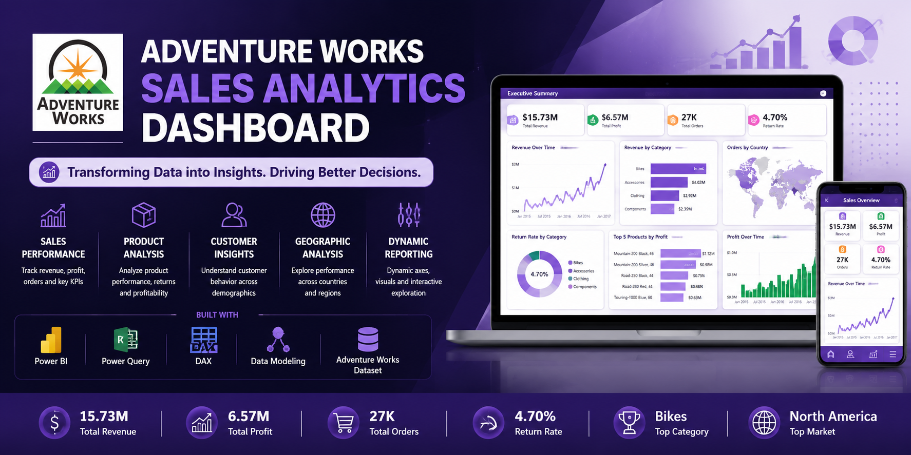
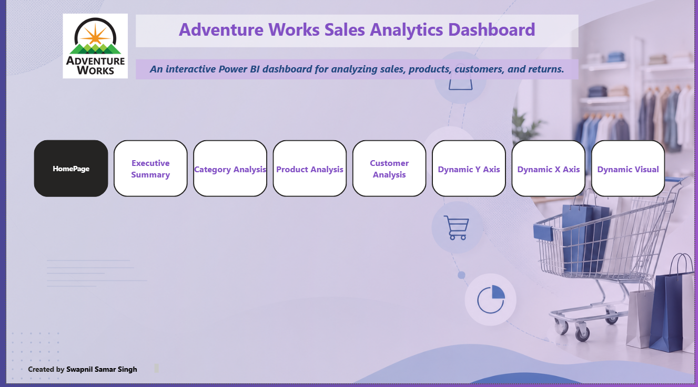
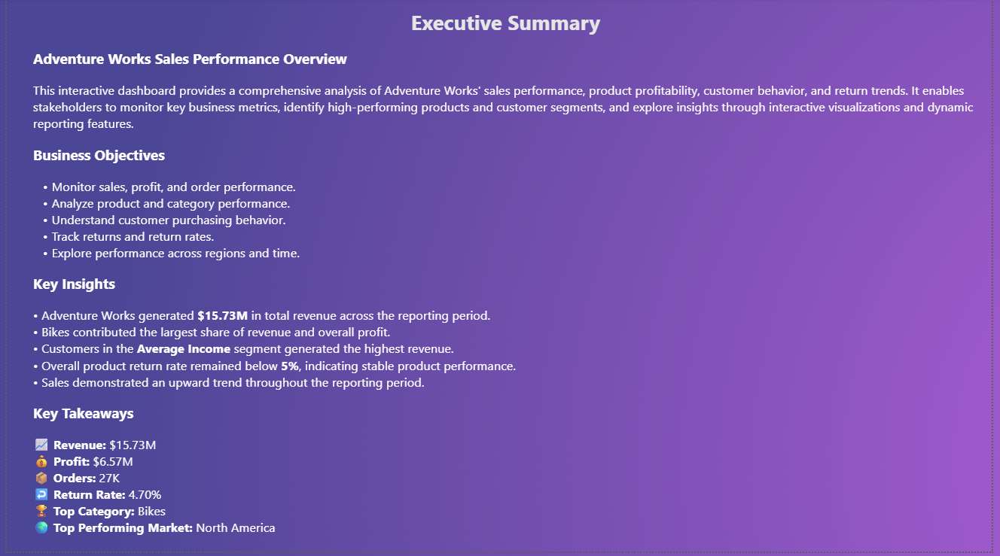
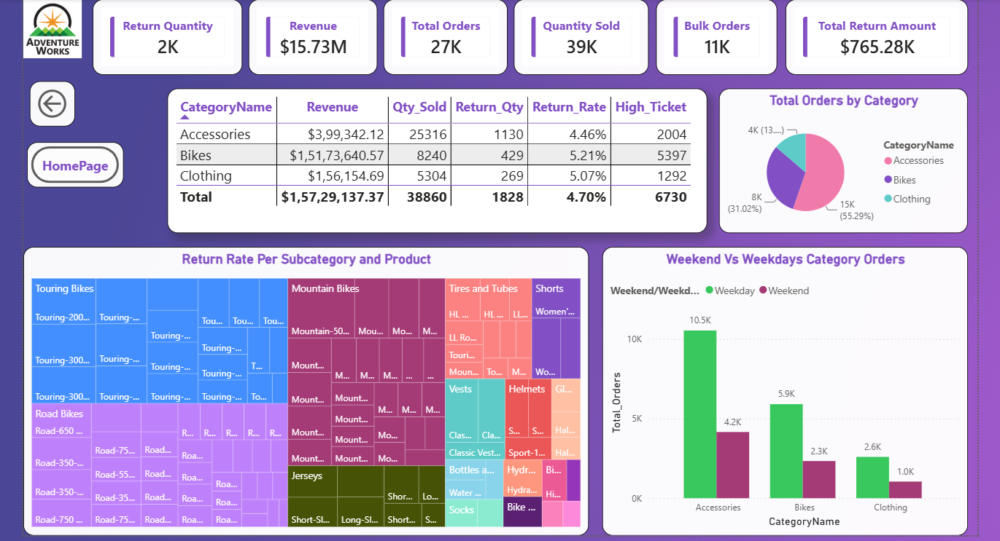
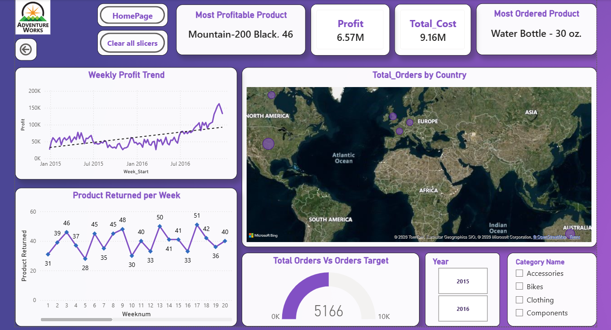
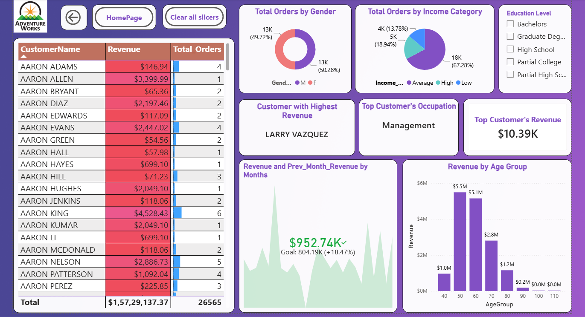
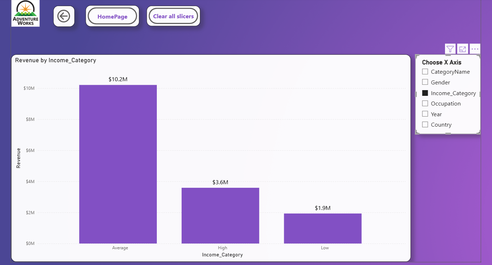
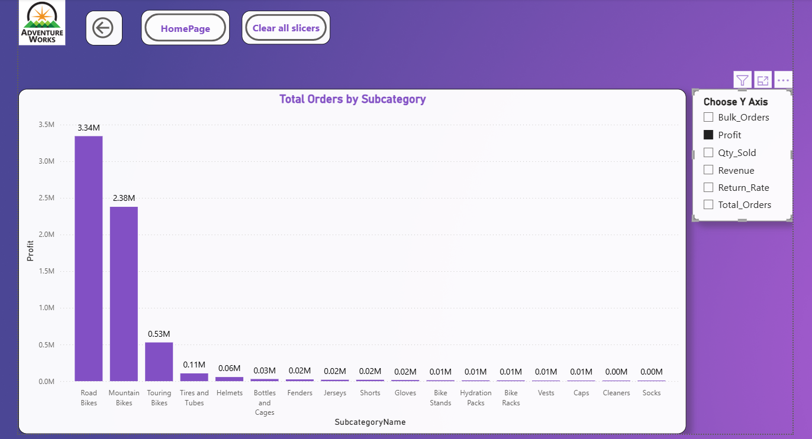
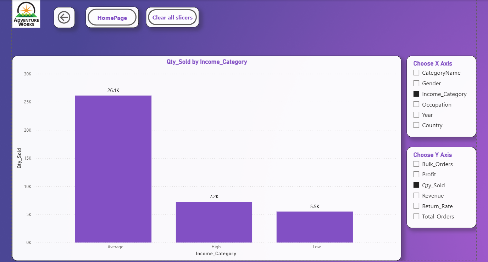

<p align="center">
  
</p>

<h1 align="center">Adventure Works Sales Analytics Dashboard</h1>

<p align="center">


</p>

---

> An interactive Power BI dashboard built to analyze sales performance, product profitability, customer behavior, and return trends using **Power BI, Power Query, and DAX**.

---

## 📌 Project Overview

The **Adventure Works Sales Analytics Dashboard** is an end-to-end Business Intelligence project designed to transform raw business data into meaningful insights. The dashboard enables stakeholders to monitor key performance indicators, evaluate product and customer performance, identify sales trends, and make data-driven decisions through interactive visualizations.

This project demonstrates practical Power BI development, including data transformation, data modeling, DAX calculations, KPI reporting, and interactive dashboard design.

---

## 🎯 Business Objectives

The dashboard was developed to answer the following business questions:

- How is the business performing in terms of sales, profit, and orders?
- Which product categories contribute the most revenue and profit?
- Which products generate the highest sales and returns?
- How do customers behave across different demographics?
- Which regions generate the highest number of orders?
- How can interactive reporting improve business analysis?

---

# 📸 Dashboard Preview

## 🏠 Home



---

## 📈 Executive Summary



---

## 📦 Category Analysis



---

## 🛒 Product Analysis



---

## 👥 Customer Analysis



---

## 📊 Dynamic Reporting

| Dynamic X Axis | Dynamic Y Axis | Dynamic Visual |
|----------------|----------------|----------------|
|  |  |  |

---

# 🚀 Dashboard Features

### Executive Dashboard

- Executive KPI Overview
- Revenue & Profit Monitoring
- Sales Trend Analysis
- Key Business Insights

### Category Analysis

- Revenue by Category
- Quantity Sold
- Return Quantity
- Return Rate
- High Ticket Orders
- Weekend vs Weekday Orders
- Category Performance Comparison

### Product Analysis

- Most Profitable Product
- Most Ordered Product
- Weekly Profit Trend
- Product Returns
- Country-wise Orders
- Target vs Actual Orders

### Customer Analysis

- Revenue by Customer
- Orders by Gender
- Revenue by Income Group
- Revenue by Age Group
- Top Customer
- Customer Occupation Analysis

### Interactive Features

- Dynamic X-Axis Selection
- Dynamic Y-Axis Selection
- Dynamic Visual Switching
- Custom Report Tooltips
- Interactive Navigation Buttons
- Drill-through Analysis
- Slicers & Filters

---

# 📊 Key KPIs

| KPI | Value |
|------|------:|
| Revenue | $15.73M |
| Profit | $6.57M |
| Total Orders | 27K |
| Quantity Sold | 39K |
| Return Quantity | 2K |
| Return Rate | 4.70% |

---

# 🧠 DAX Measures Implemented

Some of the key DAX calculations used in this project include:

- Revenue
- Profit
- Total Orders
- Quantity Sold
- Return Quantity
- Return Rate
- High Ticket Orders
- Bulk Orders
- Previous Month Revenue
- Previous Month Orders
- Monthly Target Orders
- Average Retail Price
- Top Customer Revenue
- Most Profitable Product
- Most Ordered Product

---

# 🏗 Data Model

The dashboard follows a **Star Schema** data model.

### Fact Tables

- Sales
- Returns

### Dimension Tables

- Calendar
- Customers
- Products
- Categories
- Subcategories
- Territories

This structure improves model performance, simplifies relationships, and supports efficient DAX calculations.

---

# 🛠 Technologies Used

| Tool | Purpose |
|------|---------|
| Power BI Desktop | Dashboard Development |
| Power Query | Data Cleaning & Transformation |
| DAX | Business Calculations |
| Data Modeling | Star Schema Design |
| Adventure Works Dataset | Business Data |

---

# 📁 Repository Structure

```
AdventureWorks-Sales-Analytics-Dashboard
│
├── Dashboard
│   └── AdventureWorks_Sales_Analytics.pbix
│
├── Dataset
│
├── Documentation
│
├── Images
│
├── LICENSE
│
└── README.md
```

---

# ▶️ Getting Started

1. Clone this repository.
2. Open the `.pbix` file using **Power BI Desktop**.
3. Refresh the data if required.
4. Explore the dashboard using filters, slicers, and navigation buttons.

---

# 💡 Skills Demonstrated

- Business Intelligence
- Data Visualization
- Dashboard Design
- Data Modeling
- Power Query
- DAX
- KPI Development
- Time Intelligence
- Interactive Reporting
- Business Analytics
- Storytelling with Data

---

# 📈 Future Improvements

- Publish dashboard to Power BI Service
- Implement Row-Level Security (RLS)
- Add forecasting visuals
- Add drill-through pages
- Optimize model performance
- Automate dataset refresh

---

# 👨‍💻 Author

**Swapnil Samar Singh**

Aspiring Data Analyst passionate about Business Intelligence, SQL, Python, Power BI, and Data Analytics.
